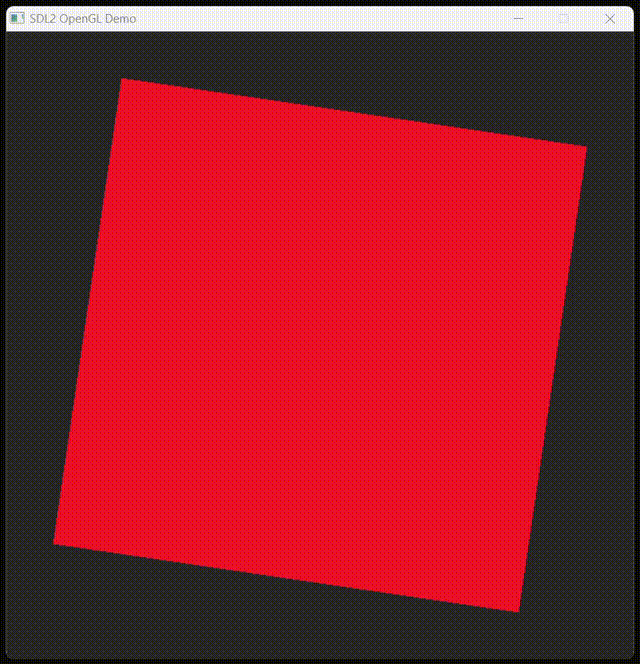
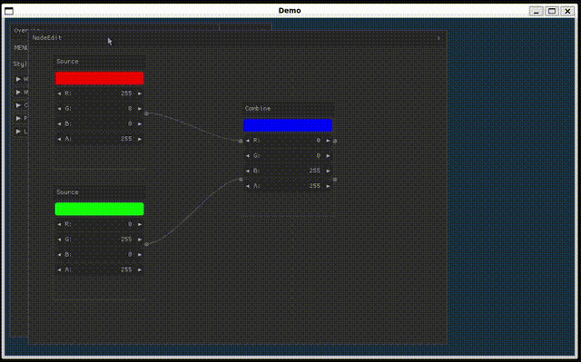

# CJIT for graphical applications

Be welcome to the exciting world of graphical C applications using SDL
([Simple DirectMedia Layer](https://sdl.org)). SDL, originally
developed by Sam Lantinga in 1998, is a powerful, cross-platform
library designed to provide low-level access to audio, keyboard,
mouse, and graphics hardware via OpenGL and Direct3D. It is an ideal
choice of free and open source library to create graphical
applications that run seamlessly across different operating systems.

Whether you're developing games, simulations, or interactive tools,
the combination of CJIT's simplicity in C code execution and [SDL's
cross-platform
capabilities](https://wiki.libsdl.org/SDL2/Installation) offers a
solution for your graphical application needs.

As in the previous chapter, the following sections will guide you
through practical usage examples, demonstrating how to create
graphical applications. 🌟📚

## The Beauty of Random

First download SDL for your platform. In Windows we download and extract a zip archive, on other system we install the latest SDL from package managers.


=== "MS/Windows"
    ```
    Invoke-WebRequest -Outfile SDL2-devel.zip -Uri https://github.com/libsdl-org/SDL/releases/download/release-2.30.9/SDL2-devel-2.30.9-mingw.zip
    unzip SDL2-devel.zip
    ```

=== "Apple/OSX"
    ```
    brew install sdl2
    ```

=== "GNU/Linux"
    ```
    sudo apt-get install libsdl2-dev
    ```

Then download the [sdl2_noise.c](https://github.com/dyne/cjit/blob/main/examples/sdl2_noise.c) example:

=== "MS/Windows"

    ```
    Invoke-WebRequest -Uri "https://raw.githubusercontent.com/dyne/cjit/refs/heads/main/examples/sdl2_noise.c" -OutFile "sdl2_noise.c"
    ```

=== "Apple/OSX"

    ```
    curl -sLo sdl2_noise.c https://raw.githubusercontent.com/dyne/cjit/refs/heads/main/examples/sdl2_noise.c
    ```

=== "GNU/Linux"

    ```
    curl -sLo sdl2_noise.c https://raw.githubusercontent.com/dyne/cjit/refs/heads/main/examples/sdl2_noise.c
    ```

Then as usual execute it passing the source file as argument to CJIT. Since we are calling functions shared by a library, we'll add some extra parameters:

=== "MS/Windows"

    ```
    .\cjit.exe .\sdl2_noise.c -I.\SDL2-2.30.9\x86_64-w64-mingw32\include\ -L.\SDL2-2.30.9\x86_64-w64-mingw32\bin\
    ```

=== "Apple/OSX"

    ```
    ./cjit ./sdl2_noise.c -lSDL2
    ```

=== "GNU/Linux"

    ```
    ./cjit ./sdl2_noise.c -lSDL2
    ```


!!! info
    This preview looks blurred because video compression cannot deal well with randomness.

Have a look inside [sdl2_noise.c](https://github.com/dyne/cjit/blob/main/examples/sdl2_noise.c), and at the beginning of the file you'll see some particular lines of code worth explaining:

### The "hashbang"
```sh
#!/usr/bin/env cjit
```

This line indicates that the source file is a script that can be executed using the `cjit` interpreter when the executable bit is enabled and if the CJIT interpreter is found in PATH.

!!! warning
    The hashbang works only on Apple/OSX and GNU/Linux, where any file can be made executable with `chmod +x`

### The pragma lib
```c
#pragma comment(lib, "SDL2")
```

This line tells CJIT to link the `SDL2` shared library (the one installed on the system or found inside an `-L` path) and allows the source code to call functions provided by it. It is the equivaled of `-lSDL2` on the commandline, with the only difference that it can be specified inside the source code.

!!! info
    For Windows this means to look for `SDL2.dll` in a path indicated by `-L`. Another way to link libraries in Windows is to copy the `dll` files inside the same folder of the source code and add their filename to the list of arguments.

### The SDL2 fix

```c
#define SDL_DISABLE_IMMINTRIN_H 1
#define SDL_MAIN_HANDLED 1
```

These lines tell SDL to disable some functionalities that break CJIT's execution. Without them defined before the `#include <SDL2/SDL.h>` line Windows applications will crash.

## Three Dimensions

To draw accelerated graphics and 3D objects we'll use OpenGL, short for Open Graphics Library: this is a cross-language, cross-platform API for rendering 2D and 3D vector graphics. Originally developed by Silicon Graphics Inc. (SGI) in 1992, OpenGL has become a widely adopted standard in the graphics industry.

Combining OpenGL with CJIT enables you to take full advantage of GPU accelerated graphics rendering while leveraging the dynamic capabilities of in-memory C code compilation, to swiftly prototype and test graphics-intensive applications.

Here is how to do it. First make sure you have OpenGL on your system: Windows users don't need to worry, it is there already.

=== "MS/Windows"
    Nothing to do.

=== "Apple/OSX"
    Not sure (help testing this please!)

=== "GNU/Linux"
    ```
    sudo apt-get install libopengl-dev
    ```

Then download the [opengl.c](https://github.com/dyne/cjit/blob/main/examples/opengl.c) example we ship in CJIT, adapted from this awesome [opengl+SDL2 tutorial by Andrew Dailey](https://shallowbrooksoftware.com/posts/a-multi-platform-modern-opengl-demo-with-sdl2/).

=== "MS/Windows"
    ```
    Invoke-WebRequest -OutFile "opengl.c" -Uri "https://raw.githubusercontent.com/dyne/cjit/refs/heads/main/examples/opengl.c"
    ```

=== "Apple/OSX"
    ```
    curl -sLo opengl.c https://raw.githubusercontent.com/dyne/cjit/refs/heads/main/examples/opengl.c
    ```

=== "GNU/Linux"
    ```
    curl -sLo opengl.c https://raw.githubusercontent.com/dyne/cjit/refs/heads/main/examples/opengl.c
    ```

And execute it as usual, giving the `opengl.c` file name as argument to CJIT. In case of windows you'll have to include also the path to the SDL2 library which was used in the previous example:

=== "MS/Windows"
    ```
    .\cjit.exe ./opengl.c -DWINDOWS -I .\SDL2-2.30.9\x86_64-w64-mingw32\include\ -L.\SDL2-2.30.9\x86_64-w64-mingw32\bin
    ```

=== "Apple/OSX"
    ```
    ./cjit ./opengl.c
    ```

=== "GNU/Linux"
    ```
    ./cjit ./opengl.c
    ```



Let's have a quick look at what is happening here: please note the `-DWINDOWS` execution flag we use for Windows. Then look at the `opengl.c` code:

```c
// Taken from https://github.com/theandrew168/sdl2-opengl-demo
//
// Copyright (c) 2020 Andrew Dailey
//
// Slightly modified to be one-file and work in CJIT by Jaromil
//
// MIT License
//
// Tutorial explanation:
// https://shallowbrooksoftware.com/posts/a-multi-platform-modern-opengl-demo-with-sdl2/

#pragma comment(lib, "SDL2")

#ifdef WINDOWS
#pragma comment(lib, "opengl32")
#elif LINUX
#pragma comment(lib, "OpenGL")
#else
#pragma comment(lib, "OpenGL")
#endif
```

Below the well deserved credits for this example there are different ways to link the OpenGL library, because the library file is named differently on different platforms. We solve the problem by using a `#define` macro with symbol `WINDOWS` to branch over a different `#pragma` directive chosing the case-sensitive name of the library.

To understand the rest of the code make sure to read the [multi-platform-modern-opengl-demo-with-sdl2 tutorial](https://shallowbrooksoftware.com/posts/a-multi-platform-modern-opengl-demo-with-sdl2/).

## Nuklear widgets

Nuklear is a minimal, immediate-mode graphical user interface toolkit
written in ANSI C and licensed under public domain. It is designed to
be lightweight and highly customizable, making it an ideal choice for
developing user interfaces across different platforms.

With Nuklear, you can easily create a comprehensive set of widgets to
enhance user experience (UX) in your applications. The library
provides a wide range of components, including buttons, sliders, text
input fields, and more, all of which can be integrated seamlessly with
CJIT. This combination allows for rapid prototyping and real-time
adjustments, fostering a dynamic development process.

Nuklear's simplicity and flexibility make it the perfect companion for
CJIT, enabling you to design and implement intuitive and visually
appealing interfaces that run consistently on GNU/Linux, MS/Windows,
and Apple/OSX.

Let's dive in and discover how to create powerful and responsive
interfaces with ease! 🎨🛠️

The
[nuklear.h](https://raw.githubusercontent.com/Immediate-Mode-UI/Nuklear/refs/heads/master/nuklear.h)
header is all what you need, download it together with CJIT's example
source code.

=== "MS/Windows"
    ```
    Invoke-WebRequest -OutFile "nuklear.h" -Uri "https://raw.githubusercontent.com/Immediate-Mode-UI/Nuklear/refs/heads/master/nuklear.h"
    Invoke-WebRequest -OutFile "nuklear.c" -Uri "https://raw.githubusercontent.com/dyne/cjit/refs/heads/main/examples/nuklear.c"
    mkdir nuklear
    Invoke-WebRequest -OutFile "nuklear/calculator.c" -Uri "https://raw.githubusercontent.com/dyne/cjit/refs/heads/main/examples/nuklear/calculator.c"
    Invoke-WebRequest -OutFile "nuklear/canvas.c" -Uri "https://raw.githubusercontent.com/dyne/cjit/refs/heads/main/examples/nuklear/canvas.c"
    Invoke-WebRequest -OutFile "nuklear/node_editor.c" -Uri "https://raw.githubusercontent.com/dyne/cjit/refs/heads/main/examples/nuklear/node_editor.c"
    Invoke-WebRequest -OutFile "nuklear/overview.c" -Uri "https://raw.githubusercontent.com/dyne/cjit/refs/heads/main/examples/nuklear/overview.c"
    Invoke-WebRequest -OutFile "nuklear/style.c" -Uri "https://raw.githubusercontent.com/dyne/cjit/refs/heads/main/examples/nuklear/style.c"
    ```

=== "Apple/OSX"
    ```
    curl -sLo nuklear.h https://raw.githubusercontent.com/Immediate-Mode-UI/Nuklear/refs/heads/master/nuklear.h
    curl -sLo nuklear.c https://raw.githubusercontent.com/dyne/cjit/refs/heads/main/examples/nuklear.c
    mkdir -p nuklear
    curl -sLo nuklear/calculator.c https://raw.githubusercontent.com/dyne/cjit/refs/heads/main/examples/nuklear/calculator.c
    curl -sLo nuklear/canvas.c https://raw.githubusercontent.com/dyne/cjit/refs/heads/main/examples/nuklear/canvas.c
    curl -sLo nuklear/node_editor.c https://raw.githubusercontent.com/dyne/cjit/refs/heads/main/examples/nuklear/node_editor.c
    curl -sLo nuklear/overview.c https://raw.githubusercontent.com/dyne/cjit/refs/heads/main/examples/nuklear/overview.c
    curl -sLo nuklear/style.c https://raw.githubusercontent.com/dyne/cjit/refs/heads/main/examples/nuklear/style.c
    ```

=== "GNU/Linux"
    ```
    curl -sLo nuklear.h https://raw.githubusercontent.com/Immediate-Mode-UI/Nuklear/refs/heads/master/nuklear.h
    curl -sLo nuklear.c https://raw.githubusercontent.com/dyne/cjit/refs/heads/main/examples/nuklear.c
    mkdir -p nuklear
    curl -sLo nuklear/calculator.c https://raw.githubusercontent.com/dyne/cjit/refs/heads/main/examples/nuklear/calculator.c
    curl -sLo nuklear/canvas.c https://raw.githubusercontent.com/dyne/cjit/refs/heads/main/examples/nuklear/canvas.c
    curl -sLo nuklear/node_editor.c https://raw.githubusercontent.com/dyne/cjit/refs/heads/main/examples/nuklear/node_editor.c
    curl -sLo nuklear/overview.c https://raw.githubusercontent.com/dyne/cjit/refs/heads/main/examples/nuklear/overview.c
    curl -sLo nuklear/style.c https://raw.githubusercontent.com/dyne/cjit/refs/heads/main/examples/nuklear/style.c
    ```

This will create a small directory structure with all the source code files needed for our example:
```
.
├── nuklear
│   ├── calculator.c
│   ├── canvas.c
│   ├── node_editor.c
│   ├── overview.c
│   └── style.c
├── nuklear.c
└── nuklear.h
```

In this multiple file setup we have the main code of our example which
is
[nuklear.c](https://github.com/dyne/cjit/blob/main/examples/nuklear.c)
 call one or more example modules according to define flags. By default it will just start all modules, see around line 390:
```c
/* ===============================================================
 *
 *                          EXAMPLE
 *
 * ===============================================================*/
/* This are some code examples to provide a small overview of what can be
 * done with this library. To try out an example uncomment the defines */
#define INCLUDE_ALL
/*#define INCLUDE_STYLE */
/*#define INCLUDE_CALCULATOR */
/*#define INCLUDE_CANVAS */
#define INCLUDE_OVERVIEW
/*#define INCLUDE_NODE_EDITOR */

#ifdef INCLUDE_ALL
  #define INCLUDE_STYLE
  #define INCLUDE_CALCULATOR
  #define INCLUDE_CANVAS
  #define INCLUDE_OVERVIEW
  #define INCLUDE_NODE_EDITOR
#endif

#ifdef INCLUDE_STYLE
  #include "nuklear/style.c"
#endif
#ifdef INCLUDE_CALCULATOR
  #include "nuklear/calculator.c"
#endif
#ifdef INCLUDE_CANVAS
  #include "nuklear/canvas.c"
#endif
#ifdef INCLUDE_OVERVIEW
  #include "nuklear/overview.c"
#endif
#ifdef INCLUDE_NODE_EDITOR
  #include "nuklear/node_editor.c"
#endif

```

Starting it up is simple as usual, this time we just need to add `-I.` to tell CJIT it can look for headers in the current directory, so it will find `nuklear.h`

=== "MS/Windows"
    ```
    .\cjit.exe ./nuklear.c -I. -I.\SDL2-2.30.9\x86_64-w64-mingw32\include\ -L.\SDL2-2.30.9\x86_64-w64-mingw32\bin
    ```

=== "Apple/OSX"
    ```
    ./cjit ./nuklear.c -I.
    ```

=== "GNU/Linux"
    ```
    ./cjit ./nuklear.c -I.
    ```

And 💥Boom! enjoy Nuklear!



## That's all for now!

If you like this manual, [give CJIt a star](https://github.com/dyne/cjit), [let us know](https://dyne.org/contact) what you'd like to see next and consider making a [donation to Dyne.org](https://dyne.org/donate). Thanks!
