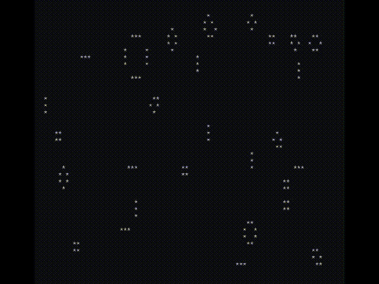

# Welcome to the CJIT Manual

CJIT is a versatile C interpreter based on TinyCC, designed to compile
C code in-memory and execute it live. This manual serves as a guide to
the full potential of CJIT, empowering you to efficiently develop and
test C programs in real-time.

CJIT is distributed as a small, all-in-one executable, ensuring a
lightweight and portable solution for your coding needs. One of its
standout features is the ability to call functions from any installed
library, making it a robust tool for rapid prototyping and dynamic
code execution on Linux, Windows, and macOS. 🖥️

The following sections will guide you through practical usage
examples, helping you to swiftly integrate CJIT into your
workflow. 📚🔧

## Hello World!

This classic example will make you create a `hello.c` file and execute
it with CJIT to print the string "Hello World!" in the terminal.

Please chose the right example code using tabs: MS/Windows, Apple/OSX
or GNU/Linux

!!! info
    **All Windows based examples are made for the PowerShell terminal**, if you are on WSL then chose GNU/Linux

Download CJIT pasting a command in the terminal

=== "MS/Windows"

    ```
    Invoke-WebRequest -OutFile "cjit.exe" -Uri "https://github.com/dyne/cjit/releases/latest/download/cjit.exe"
    ```

=== "Apple/OSX"

    ```
    curl -sLo cjit https://github.com/dyne/cjit/releases/latest/download/cjit-$(uname)-$(uname -m)
    chmod +x cjit
    ```

=== "GNU/Linux"

    ```
    curl -sLo cjit https://github.com/dyne/cjit/releases/latest/download/cjit-$(uname)-$(uname -m)
    chmod +x cjit
    ```


Then create hello.c by pasting these lines in the terminal:

=== "MS/Windows"

    ```c
    @"
    #include <stdio.h>
    #include <stdlib.h>
    int main(int argc, char **argv) {
      fprintf(stderr,"Hello, World!\n");
      exit(0);
    }
    "@| Out-File -FilePath "hello.c" -Encoding ASCII
    ```

=== "Apple/OSX"

    ```bash
    cat << EOF > hello.c
    #!/usr/bin/env cjit
    #include <stdio.h>
    #include <stdlib.h>
    int main(int argc, char **argv) {
      fprintf(stderr,"Hello, World!\n");
      exit(0);
    }
    EOF
    ```

=== "GNU/Linux"

    ```bash
    cat << EOF > hello.c
    #!/usr/bin/env cjit
    #include <stdio.h>
    #include <stdlib.h>
    int main(int argc, char **argv) {
      fprintf(stderr,"Hello, World!\n");
      exit(0);
    }
    EOF
    ```

Finally execute hello.c using CJIT with:

=== "MS/Windows"
    ```
    .\cjit.exe .\hello.c
    ```
=== "Apple/OSX"
    ```
    ./cjit hello.c
    ```
=== "GNU/Linux"
    ```
    ./cjit hello.c
    ```


As a result you will see CJIT starting and printing "Hello World!"

```
CJIT v0.8.12 by Dyne.org
Source code:
+ .\hello.c
Execution start
---
Hello, World!
```

You can now play with `hello.c`, change what you want and run it again!

## Flying Donuts

This example will print an animated donut on the terminal!

Create the `donut.c` file using the artful code below:

=== "MS/Windows"

    ```c
    @"
                 i,j,k,x,y,o,N;
             main(){float z[1760],a
          #define R(t,x,y) f=x;x-=t*y\
       ;y+=t*f;f=(3-x*x-y*y)/2;x*=f;y*=f;
       =0,e=1,c=1,d=0,f,g,h,G,H,A,t,D;char
     b[1760];for(;;){memset(b,32,1760);g=0,
    h=1;memset(z,0,7040);for(j=0;j<90;j++){
    G=0,H=1;for(i=0;i<314;i++){A=h+2,D=1/(G*
    A*a+g*e+5);t=G*A        *e-g*a;x=40+30*D
    *(H*A*d-t*c);y=          12+15*D*(H*A*c+
    t*d);o=x+80*y;N          =8*((g*a-G*h*e)
    *d-G*h*a-g*e-H*h        *c);if(22>y&&y>
     0&&x>0&&80>x&&D>z[o]){z[o]=D;b[o]=(N>0
      ?N:0)[".,-~:;=!*#$@"];}R(.02,H,G);}R(
      .07,h,g);}for(k=0;1761>k;k++)putchar
       (k%80?b[k]:10);R(.04,e,a);R(.02,d,
         c);usleep(15000);printf('\n'+(
            " donut.c! \x1b[23A"));}}
              /*no math lib needed
                 .@a1k0n 2021.*/
    "@| Out-File -FilePath "donut.c" -Encoding ASCII
    ```

=== "Apple/OSX"


    ```c
    cat << EOF > donut.c
                 i,j,k,x,y,o,N;
             main(){float z[1760],a
          #define R(t,x,y) f=x;x-=t*y\
       ;y+=t*f;f=(3-x*x-y*y)/2;x*=f;y*=f;
       =0,e=1,c=1,d=0,f,g,h,G,H,A,t,D;char
     b[1760];for(;;){memset(b,32,1760);g=0,
    h=1;memset(z,0,7040);for(j=0;j<90;j++){
    G=0,H=1;for(i=0;i<314;i++){A=h+2,D=1/(G*
    A*a+g*e+5);t=G*A        *e-g*a;x=40+30*D
    *(H*A*d-t*c);y=          12+15*D*(H*A*c+
    t*d);o=x+80*y;N          =8*((g*a-G*h*e)
    *d-G*h*a-g*e-H*h        *c);if(22>y&&y>
     0&&x>0&&80>x&&D>z[o]){z[o]=D;b[o]=(N>0
      ?N:0)[".,-~:;=!*#$@"];}R(.02,H,G);}R(
      .07,h,g);}for(k=0;1761>k;k++)putchar
       (k%80?b[k]:10);R(.04,e,a);R(.02,d,
         c);usleep(15000);printf('\n'+(
            " donut.c! \x1b[23A"));}}
              /*no math lib needed
                 .@a1k0n 2021.*/
    EOF
    ```

=== "GNU/Linux"

    ```c
    cat << EOF > donut.c
                 i,j,k,x,y,o,N;
             main(){float z[1760],a
          #define R(t,x,y) f=x;x-=t*y\
       ;y+=t*f;f=(3-x*x-y*y)/2;x*=f;y*=f;
       =0,e=1,c=1,d=0,f,g,h,G,H,A,t,D;char
     b[1760];for(;;){memset(b,32,1760);g=0,
    h=1;memset(z,0,7040);for(j=0;j<90;j++){
    G=0,H=1;for(i=0;i<314;i++){A=h+2,D=1/(G*
    A*a+g*e+5);t=G*A        *e-g*a;x=40+30*D
    *(H*A*d-t*c);y=          12+15*D*(H*A*c+
    t*d);o=x+80*y;N          =8*((g*a-G*h*e)
    *d-G*h*a-g*e-H*h        *c);if(22>y&&y>
     0&&x>0&&80>x&&D>z[o]){z[o]=D;b[o]=(N>0
      ?N:0)[".,-~:;=!*#$@"];}R(.02,H,G);}R(
      .07,h,g);}for(k=0;1761>k;k++)putchar
       (k%80?b[k]:10);R(.04,e,a);R(.02,d,
         c);usleep(15000);printf('\n'+(
            " donut.c! \x1b[23A"));}}
              /*no math lib needed
                 .@a1k0n 2021.*/
    EOF
    ```

Then make the donut fly with CJIT!

=== "MS/Windows"
    ```
    .\cjit.exe .\donut.c
    ```
=== "Apple/OSX"
    ```
    ./cjit donut.c
    ```
=== "GNU/Linux"
    ```
    ./cjit donut.c
    ```

!!! warning
    With this example and other programs, just hit **CTRL+C** to quit.

The state of affairs in CJIT is well demonstrated by this example: right now the terminal is much slower on windows (rightmost donut).


## Game of Life

Another fascinating example is the "Game of Life," a cellular
automaton devised by the British mathematician John Horton Conway
in 1970. This zero-player game simulates the evolution of a grid of
cells, showcasing complex behaviors emerging from simple rules.

Our `life.c` example is part of the [cjit-demo.tar.gz](https://github.com/dyne/cjit/releases/latest/download/cjit-demo.tar.gz) package you should download to enjoy this and other demos in this tutorial. Download, extract and **copy the cjit executable inside the cjit-demo folder**. Below are quick sequence of commands to do that:

=== "MS/Windows"

    ```
    Invoke-WebRequest -OutFile "cjit-demo.tar.gz" -Uri "https://github.com/dyne/cjit/releases/latest/download/cjit-demo.tar.gz"
    cjit.exe --xtgz cjit-demo.tar.gz
    cp cjit.exe cjit-demo
    cd cjit-demo
    ```

=== "Apple/OSX"

    ```
    curl -sLo cjit-demo.tar.gz https://github.com/dyne/cjit/releases/latest/download/cjit-demo.tar.gz
    ./cjit --xtgz cjit-demo.tar.gz
    cp ./cjit cjit-demo/
    cd cjit-demo
    ```

=== "GNU/Linux"

    ```
    curl -sLo cjit-demo.tar.gz https://github.com/dyne/cjit/releases/latest/download/cjit-demo.tar.gz
    ./cjit --xtgz cjit-demo.tar.gz
    cp ./cjit cjit-demo/
    cd cjit-demo
    ```

You may notice from the commands above that cjit is capable of decompressing `tar.gz` packages, which are like compressed zip files containing files and folders.

Then execute the `life.c` source file passing it as argument to `cjit`, the same way it was done for the flying donut.

=== "MS/Windows"

    ```
    cjit.exe life.c
    ```

=== "Apple/OSX"

    ```
    ./cjit life.c
    ```

=== "GNU/Linux"

    ```
    ./cjit life.c
    ```


Enjoy watching this basic terminal version of the Game of Life, then move on to the next section to see its graphical version in its full glory 🎇



Pretty cool stuff for some "boring" terminal session eh? Have a look
around the `life.c` file with your favorite text editor and feel free
to change things and see what happens.

# ⏩ [Next: graphics with CJIT](graphics)

Now you are familiar with the way to execute CJIT! If you think that C
is fun (and fast!) you are welcome to read the next chapter of this
manual and discover one of many ways to run graphical applications.
