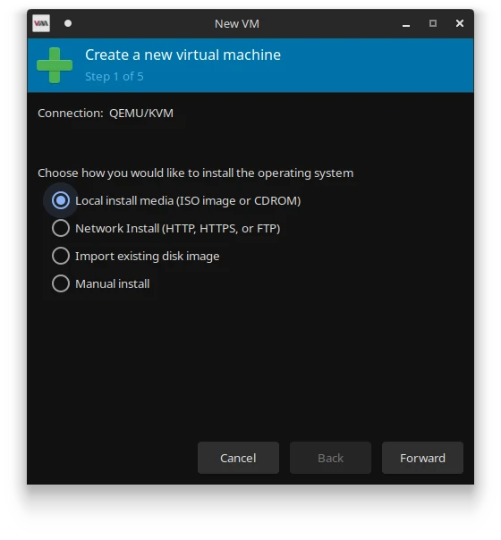
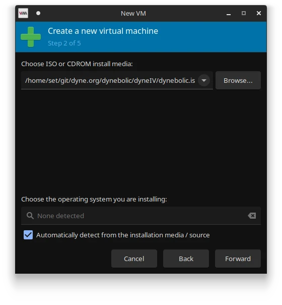
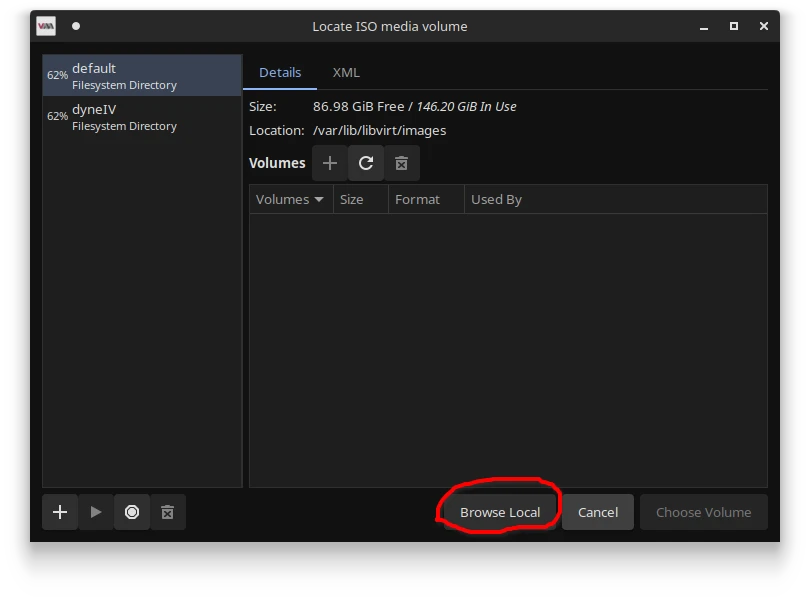
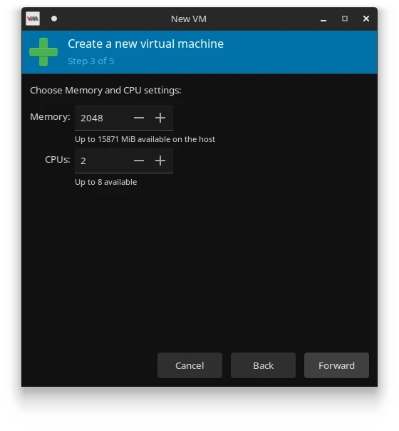
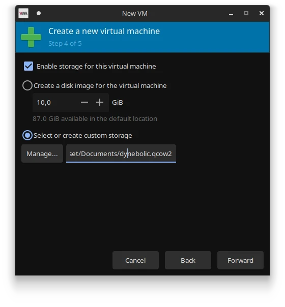
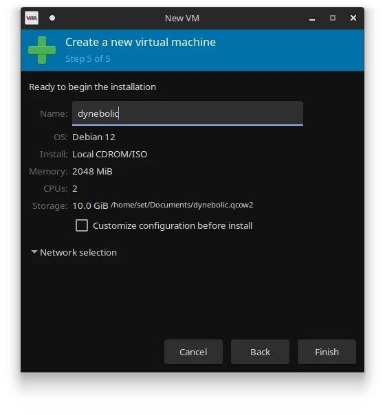
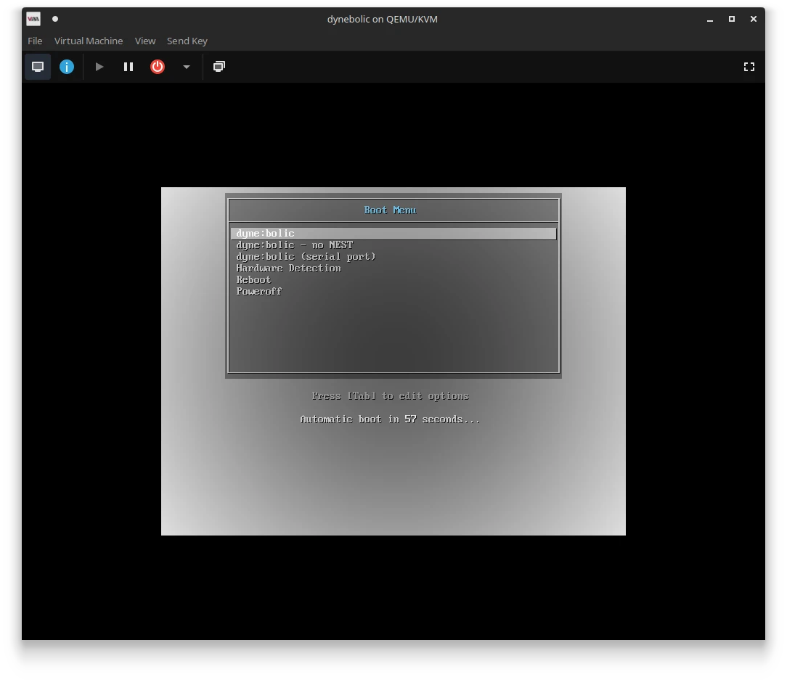

# Booting dynebolic

There are many ways to boot dynebolic on your computer. First, you need to [download the ISO](https://dyne.org/dynebolic/download/) file and verify the checksum.

## Booting from usb

### On windows

On Windows you can use an application called [Rufus](https://rufus.ie/) to flash the ISO file to a USB drive.
The interface is very intuitive, plug the usb stick, select the volume to install on and the ISO image you just downloaded to install. After pressing start it will recognize the image and will ask you to either install normally or in `dd mode`, **please select `dd mode`**.

### On GNU+Linux

On GNU+Linux, find the device name of your USB stick, with this command:

```
lsblk -o NAME,SIZE,RO,TYPE,VENDOR,HOTPLUG
```

The name you are looking for should be something like `/dev/sdX` (where "X" is a letter defined by your system). Read the information carefully, because it will include de `sdX` name of the main drive of your computer. Once you've determined the name of your USB stick, run this command as root:

```
dd bs=4M if=dynebolicIV.iso of=/dev/sdX status=progress && sync`
```

!!! note

    You *have* to adapt this line so that "X" represents its actual value in your system.

Once this command has completed, the USB stick will be ready to boot.

**Be sure to know the hotkey to press at boot for boot selection, or bios interface to configure USB boot**.

---

## Booting in a Virtual Machine

A virutal machine allows you to run an Operative System within your running Operative system. This way you can leverage all that dynebolic has to offer without the need to install it on your machine.

#### Virtual Machine Manager

On of the most user-friendly ways to run dynebolic in a virutal machine is using [Virtual Machine Manager](https://virt-manager.org/). This tool will provide you with a GUI and take care of many complicated parts such as the routing to your physical audio and network tools more or less seemlessly. It also sets everything up to have copy+paste working from your physical machine's desktop to dynebolic.

To install Virtual Machine Manager, follow the [instructions on their website](https://virt-manager.org/)

Once installed you can run it an add a virtual machine. To do this follow these intstructions

Hit the "+" button in the upper left corner of the GUI. You will be presented with a prompt asking you to choose how you would like to install the operative system.

<figure markdown="span">
  
  <figcaption>Chose "Local install media"</figcaption>
</figure>

In the next panel, you are asked to pick the file you want to use.

<figure markdown="span">
  
  <figcaption>Chose ISO</figcaption>
</figure>

This will open prompt that allows you brose your file system. Click "Browse Local" and locate the ISO file you downloaded from dynebolic.org

<figure markdown="span">
  
  <figcaption>Pick the ISO file you downloaded</figcaption>
</figure>

You will come back to the previous window, chose an operative system. Since Devuan is based on Debian chose, "Debian 12 and click "Forward".

In the next prompt, you are invited to allocate resources to the virtual machines in terms of CPU cores and RAM. You can safely allocate half of your resouces for both. In this example the machine has 4 cores and 4GB (4096 bytes) ram. So we allocate 2 cores and 2Gb (2048 bytes) RAM.

<figure markdown="span">
  
  <figcaption>Alocate resources</figcaption>
</figure>

In the next prompt, you can allocate disk space to your virtual machine. This is a file that will be mounted as if it was a drive. It will contain all the data you create, so you might want to choose a good location for it. The extention for the file is `.qcow2`. In the screenshot bellow, we gave it 10Gb and stored the file in `~/Documents/dynebolic.qcow2`

<figure markdown="span">
  
  <figcaption>Alocate diskspace</figcaption>
</figure>

We then get a chance to review the settings and name the Virtual Machine. Let's name it "dynebolic" and click "Finish".

<figure markdown="span">
  
  <figcaption>Name the Virtual Machine</figcaption>
</figure>

This will initiate the virtual machine and you should now see a virtual screen with a boot slection. Pick the first entry by hiting the Enter key on your keyboard.

<figure markdown="span">
  
  <figcaption>Run the Virtual Machine</figcaption>
</figure>

**Voilà! Give a few moments, and dynebolic will boot inside your computer.**

---

#### QEMU (TODO)
[QEMU](https://www.qemu.org/) is a generic and open source machine emulator and virtualizer.


### On windows (todo)
