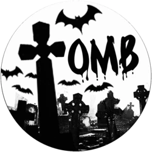
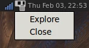
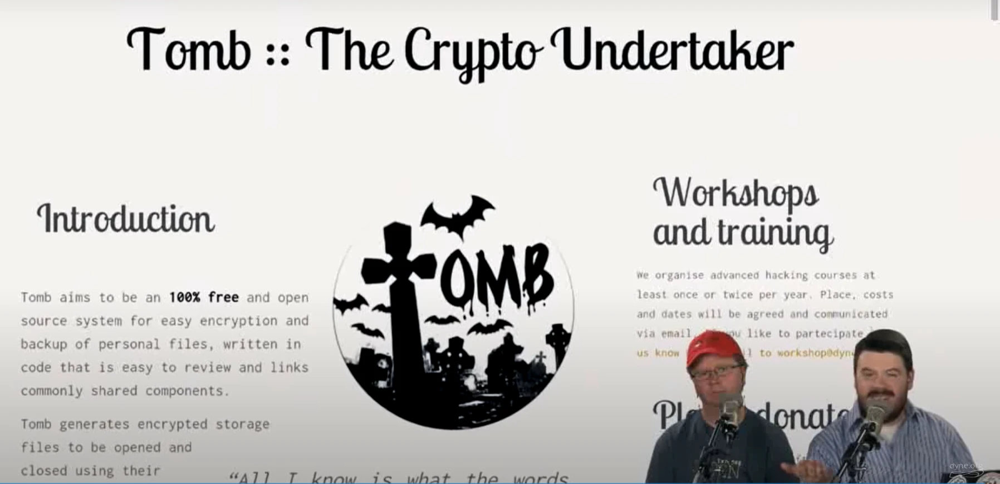
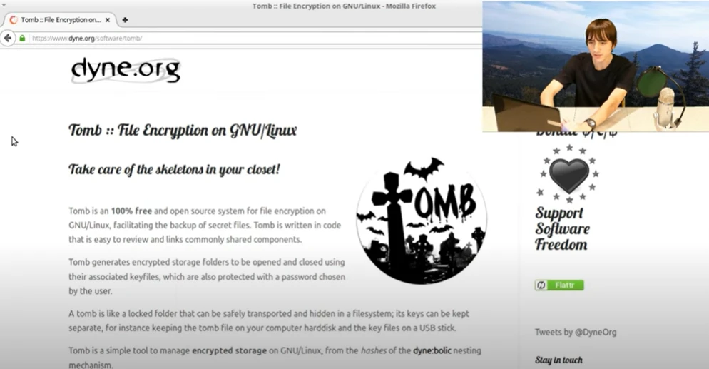

---
layout: ../../layouts/Layout.astro
title: "Tomb :: Folder Encryption on GNU/Linux"
description: "Tomb is a system to make strong encryption easy for everyday use. A tomb is like a locked folder that can be safely transported and hidden in a filesystem."
cover: "https://dyne.org/social/tomb.png"
---


<figure markdown="span">
  
  <figcaption>Tombs and Bats</figcaption>
</figure>

Tomb is a **100% Free and Open Source** tool to manage secret files in volumes protected by **strong encryption**.

Tomb's ambition is to improve safety by way of:

- A **minimalist** design consisting of small and readable code
- The facilitation of **good practices**, i.e.: key/storage physical separation
- The adoption of a few standards and **battle-tested** components


## How it works

We design Tomb's hidden file encryption to generate encrypted **storage folders** to be opened and closed using associated **key files**, which are also protected with a **password** chosen by the user.

A tomb is a file whose **contents are kept secret and indistinguishable**; it can be safely **renamed, transported and hidden in filesystems**; its **keys should be kept separate**, for instance, keeping the tomb file on your computer's hard disk and the key files on a USB stick. **Once open, the tomb looks like a folder**.

Tomb derives from scripts used in the [dyne:bolic](http://dynebolic.org/) 100% Free GNU/Linux distribution and a shell script (Zsh) using standard filesystem tools (GNU) and the cryptographic API of the Linux kernel (dm-crypt and LUKS via cryptsetup). Tomb's status and error messages are **translated into many human languages** and have **multiple graphical applications** to operate.

<figure markdown="span">
  
  <figcaption>Screenshot of a menu entry in a Desktop Environment</figcaption>
</figure>


## Get Started

**Tomb works only on GNU/Linux systems and WSL2 starting with Windows11**.

If you are already familiar with using the command line, [download the tar.gz](https://files.dyne.org/tomb) and jump to the [installation instructions](https://github.com/dyne/Tomb/blob/master/INSTALL.md).

Tomb is also found in [many distributions](https://repology.org/project/tomb/versions), so you can use your package manager to install it.

However, **Tomb is a single script** and is very easy to install manually. Using `make install` in our source distribution will copy it into `/usr/local/bin` along with its manpage (`man tomb`) and language translations.

Be in charge of your system, and **may the source be with you**!

<figure markdown="span">
  
  <figcaption>Tomb Songs are the best kept musical secrets in the world</figcaption>
</figure>


## Usage

Tombs are operated from a terminal command line and require **root access** to the machine (or just sudo access to the script).

To create a 100MB tomb called "secret" do:

```
tomb dig -s 100 secret.tomb
tomb forge secret.tomb.key
tomb lock secret.tomb -k secret.tomb.key
```

To open it, do
```
tomb open secret.tomb -k secret.tomb.key
```
And to close it
```
tomb close
```
Or if you are in a hurry
```
tomb slam all
```
Will close immediately all open tombs, killing all applications using them.

Here is a **lovely review made by the Linux Action Show guys** in August 2014, where they recommend Tomb as a replacement for Veracrypt

<figure markdown="span">
  [](https://www.youtube-nocookie.com/embed/CMLJmfjCaGM?si=HZX5rpKEVq_QWSg6)
  <figcaption>Thumbnail from a Linux Action Show Guys video</figcaption>
</figure>


## Advanced usage

The tomb script takes care of several details to improve a user’s
behaviour and the security of tombs in everyday usage: it protects the
typing of passwords from keyloggers, facilitates hiding keys inside
images, mounts directories in place without copying delicate files around, allows a user to kill all running processes and slam close a tomb in a straightforward command, warns the user about free space and last-time usage, etc.


One can use **multiple tombs** simultaneously on the same system and list them using `tomb list`.


Using `tomb resize`, one can **expand tombs** to have more space (but cannot shrink them).


When it is open, a tomb can **bind contents inside the user’s `$HOME`** folder using `bind-hooks`. For instance, `.gnupg` will only be found inside your `$HOME` when the tomb opens.


A tomb can be used on a local machine with **keys on a server** and never stored on the same device: `ssh me@dyne.org 'cat my.tomb.key' | tomb open my.tomb -k -` the option `-k -` tells tomb to take the key from stdin.


It is also possible to **store a tomb on a cloud service and mount it locally**, ensuring remote servers cannot access contents. One can use **sshfs** for this:

```
sshfs -o allow_root me@dyne.org:/ /mnt/cloud/
tomb open /mnt/cloud/my.tomb -k my.key
```

[This paper](https://www.researchgate.net/publication/262698824_Data_privacy_in_Desktop_as_a_Service) provides a lot of details about using tombs hosted on cloud storage.


Tomb also supports **deniable key storage** using steganography. One can `tomb bury` and `tomb exhume` keys to and from `JPEG` images when the utility `steghide` is installed. When securing private data, one must never forget where the keys are. It may be easier to remember a picture, as well it may be less suspicious to transport it and exchange it as a file.


The command `tomb engrave` also allows to backup keys on paper by saving them as printable QR codes, to hide it between the pages of a book. To recover an engraved key, one can scan it with any phone and save the resulting plain text file as the tomb key.


You can also watch this other video guide by Nerd on the Street.

<figure markdown="span">
  [](https://www.youtube-nocookie.com/embed/IgO19-3ffrY)
  <figcaption>Thumbnail from a Nerd on the Street video</figcaption>
</figure>


## External applications

The following applications are compatible with Tomb:

- [pass-tomb](https://github.com/roddhjav/pass-tomb) is a console-based wrapper of the excellent password-keeping program [pass](https://www.passwordstore.org) that helps to keep the whole tree of passwords encrypted inside a tomb.

- [Secrets](https://secrets.dyne.org) is an online software to split a Tomb key into shares that a quorum of owners can merge to reconstitute.

- [Mausoleum](https://github.com/mandeep/Mausoleum) is a graphical interface to facilitate the creation and management of tombs, written in Python.

- [zuluCrypt](https://mhogomchungu.github.io/zuluCrypt/) is a graphical application to manage various types of encrypted volumes on GNU/Linux, among them also Tombs, written in C++.


## Frequently asked questions

You can find a list of [Frequently Asked Questions (FAQ) on the website](https://dyne.org/tomb)

## Development

<figure markdown="span">
  
  <figcaption>A sugarskull octocat</figcaption>
</figure>

Tomb is on [GitHub](https://github.com/dyne/Tomb), where most of the community activity goes.

Developers can interact with us via a discussion area, issues, or pull requests. The README is also a brief introduction for developers willing to engage.

The [short tomb tester howto](https://github.com/dyne/Tomb/wiki/TesterHowTo) provides a guide to troubleshooting problems. Anyone planning to write code in Tomb should first look at the [short tomb developer howto](https://github.com/dyne/Tomb/wiki/DeveloperHowto).

To get in touch with us in person please plan to participate in one of the yearly [italian hackmeeting](http://hackmeeting.org), usually held during summer on the peninsula.

<figure markdown="span">
  
  <figcaption>A cheerful picture of Tomb developers crew at Hackmeeting 2011 in Firenze</figcaption>
</figure>


> All I know is what the words know, and dead things, and that makes a handsome little sum, with a beginning and a middle and an end, as in the well-built phrase and the long sonata of the dead. - Samuel Beckett

